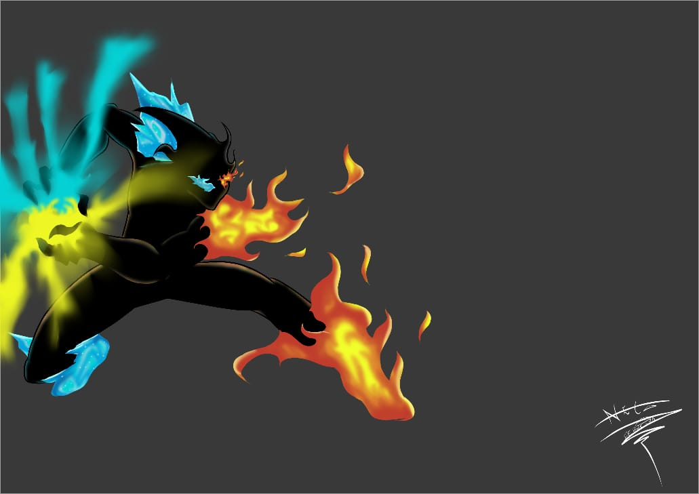

**Meu Portfólio**

**Quem eu sou?**

 

**Neto Ferreira**, aluno do IFRN CM (campus Ceará-Mirim), um futuro designer gráfico, que talvez trabalhe em jogos. Atualmente no 3º ano de Jogos Digitais, faço as artes dos jogos em que trabalho. Descobri gostar da área de design no curso, após realizar alguns trabalhos em projetos do professor Durval e Marcelo.   

**Contatos**

- **Instagram:** @neto_ferreira.png

- **E-mails:** netho-ferreira@hotmail.com e netthofherreira@gmail.com

**Minhas Artes**

**Tela inicial do Geritama**


**Geritama usando a combinação de seus poderes (inspirado no Kamehameha do Goku)**


**Geritama poder de gelo**


**Uma tentativa de usar o pixel art**


**Alguns esboço da criação do Geritama**


**Primeiro desenho feito com a mesa digitalizadora**


**Personagem criada para o projeto do professor marcelo, na qual desenvolvo algumas artes.** 


**Rael**(Personagem principal do jogo do 4º bimestre de Oficina)


**Animação da personagem do 4º jogo correndo**


**Animação da personagem do do 4º jogo usando o especial**


**Animação da personagem do 4º jogo pulando**


----------------------------------------------------------------------------------------------------------------------------------------

**Jogos em que trabalhei junto a alguns colegas** 

**CrocoBite**

[](https://danilo25.github.io/CrocoBite/)

**For You**

[](https://raixasantos.github.io/ForU/)

**Geritama**

[](https://tawanferreira10.github.io/geritama/)

**Fallen Sky**


**Algumas artes do jogo For you**


**Algumas artes do jogo Geritama**


### Markdown

programador 
Markdown is a lightweight and easy-to-use syntax for styling your writing. It includes conventions for

```markdown
Syntax highlighted code block

# Header 1
## Header 2
### Header 3

- Bulleted
- List

1. Numbered
2. List

**Bold** and _Italic_ and `Code` text

[Link](url) and 
```

For more details see [GitHub Flavored Markdown](https://guides.github.com/features/mastering-markdown/).

### Jekyll Themes

Your Pages site will use the layout and styles from the Jekyll theme you have selected in your [repository settings](https://github.com/NetoFerreira/NetoFerreira.github.io/settings). The name of this theme is saved in the Jekyll `_config.yml` configuration file.

### Support or Contact

Having trouble with Pages? Check out our [documentation](https://help.github.com/categories/github-pages-basics/) or [contact support](https://github.com/contact) and we’ll help you sort it out.
