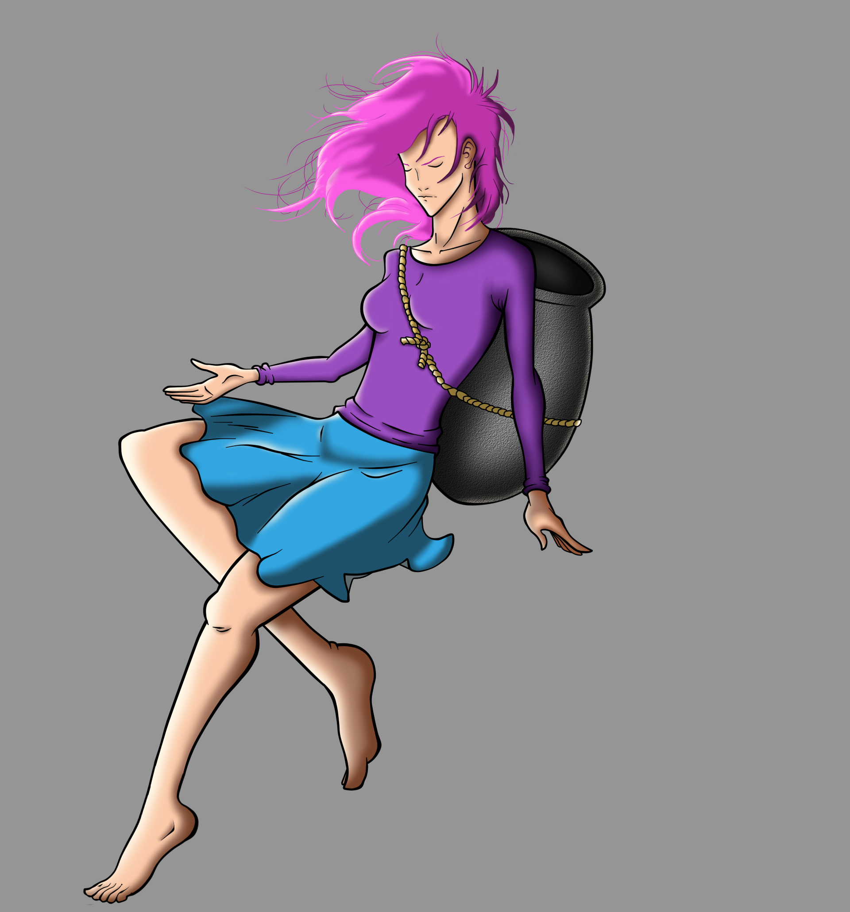

**Meu Portfólio**

**Quem eu sou?**

 

**Neto Ferreira**, aluno do IFRN CM (campus Ceará-Mirim), um futuro designer gráfico, que talvez trabalhe em jogos. Atualmente no 3º ano de Jogos Digitais, faço as artes dos jogos em que trabalho. Descobri gostar da área de design no curso, após realizar alguns trabalhos em projetos do professor Durval e Marcelo.   

**Contatos**

- **Instagram:** @neto_ferreira.png

- **E-mails:** netho-ferreira@hotmail.com e netthofherreira@gmail.com

----------------------------------------------------------------------------------------------------------------------------------------

**Minhas Artes**

**Geritama**, esse personagem vive em mundo onde monstros são capturados e obrigados a lutar contra 
"o escolhido", que é o monstro capturado e exposto há vários outros monstros que vão tentar. No jogo, o "o escolhido" é o Geritama, um personagem híbrido, possui o poder do fogo e do gelo.

**Geritama usando a combinação de seus poderes (inspirado no Kamehameha do Goku)**

**Geritama poder de gelo**

**Uma tentativa de usar o pixel art**

**Alguns esboço da criação do Geritama**

**Primeiro desenho feito com a mesa digitalizadora**

**Personagem criada para o projeto do professor marcelo, na qual desenvolvo algumas artes.** 

**Rael**, essa personagem é o último anjo caído. Logo após cair no mundo apocalíptico, ela tem uma de suas roubadas por seu irmão **Lúcifer**.

**Lúcifer**, esse personagem é o Boss do jogo e o irmão de **Rael**, que roubou a asa dela.

**(Lúcifer)** Só coloquei essa porque a pose ficou legal.

----------------------------------------------------------------------------------------------------------------------------------------

↓↓ **Jogos em que trabalhei junto a alguns colegas** ↓↓

**CrocoBite**

----------------------------------------------------------------------------------------------------------------------------------------

**For You**

----------------------------------------------------------------------------------------------------------------------------------------

**Geritama**

----------------------------------------------------------------------------------------------------------------------------------------

**Fallen Sky**

----------------------------------------------------------------------------------------------------------------------------------------

**Algumas artes do jogo For you**

**Remake da tela inicial do For You**

----------------------------------------------------------------------------------------------------------------------------------------

----------------------------------------------------------------------------------------------------------------------------------------

**Algumas artes do jogo Geritama**

----------------------------------------------------------------------------------------------------------------------------------------

**Animação da personagem do 4º jogo correndo**

**Animação da personagem do do 4º jogo usando o especial**

**Animação da personagem do 4º jogo pulando**

